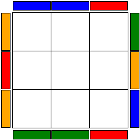

[](https://travis-ci.org/justinj/cubeseer)

CubeSeer
--------

CubeSeer is a Ruby cube image generation library,
similar to [VisualCube](http://cube.crider.co.uk/visualcube.php).

Right now only a top view is possible,
which works well for PLL diagrams.

Examples
--------

The links show how each image was created, they might take a moment to show up since they are hosted on a free Heroku account.


[Sexy Move!](http://cubeseer.herokuapp.com/cube?alg=RUR'U')



[It works great for PLLs](http://cubeseer.herokuapp.com/cube?case=RUR'U'R'FR2U'R'U'RUR'F')


[If you're used to virtual cubes, you can supply an alg that way too](http://cubeseer.herokuapp.com/cube?heise=kjejjifdkjejjifd)


[Different sized cubes are also possible](http://cubeseer.herokuapp.com/cube?size=4&alg=RwU2xRwU2RwU2Rw'U2LwU2Rw'U2RwU2Rw'U2Rw')


[Changing the colour scheme](http://cubeseer.herokuapp.com/cube?colors=wrgboy&heisecase=kufkufkufkuffkufkufkufku)


[Ignoring stickers lets you create OLL diagrams as well](http://cubeseer.herokuapp.com/cube?colors=yxxxxx&heisecase=hkhiifkfijkgg)

TODO
----

* Cube rendering
  * 3D view
  * Rounded side stickers, like VisualCube has

* Cube representing
  * Create by explicitly setting each sticker
  * Deeper than two levels for moves is not possible, need to implement a more general notation, like SiGN

* CLI

Cube Representation
-------------------

The representation of a cube as implemented in `cube.rb` works as follows:

A cube can currently be created only by calling the method `Cube.algorithm`,
which takes a size and an alg to perform on a solved cube.

Once you have that cube,
you can perform queries on it of the form "ABC:XYZ"

Where ABC and XYZ are corners with a specific orientation.

This will return an array of arrays representing the stickers on that face.

For example, "UBL:UFR" will return from the top left corner of U to the bottom left corner.

On a solved cube this will be

```ruby
[[:U, :U, :U],
 [:U, :U, :U],
 [:U, :U, :U]]   
```

Server
------

There is a sinatra server that serves images of cubes in the server/server.rb file.

It currently takes the following options:

* alg - An algorithm to perform on a solved cube
* case - An algorithm that should _solve_ the image presented
* heise - An algorithm, in heise sim notation, to perform on a solved cube
* heisecase - An algorithm, in heise sim notation, that should solve the image presented
* size - The size of the cube to show
* colors - The colors, in U R F D L B order, to have on the cube. The following colors are supported:
  * w => :white
  * r => :red
  * g => :green
  * o => :orange
  * y => :yellow
  * b => :blue
  * x => :gray
